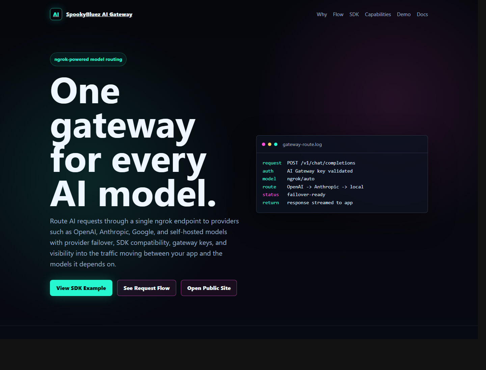
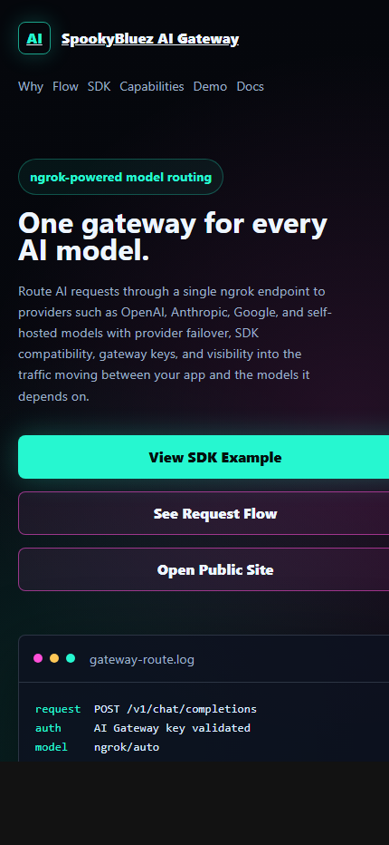

# SpookyBluez AI Gateway

[](https://github.com/Spookybluez/spookybluez-ai-gateway/actions/workflows/deploy-cloudflare-pages.yml)
[](https://spookybluez-ai-gateway.pages.dev)

Static landing page for the SpookyBluez AI Gateway demo.

It also includes a Cloudflare Pages Function proxy for OpenClaw workflow webhooks:

```text
https://spookybluez-ai-gateway.pages.dev/plugins/webhooks/github-actions
https://spookybluez-ai-gateway.pages.dev/plugins/webhooks/make
https://spookybluez-ai-gateway.pages.dev/plugins/webhooks/power-automate
https://spookybluez-ai-gateway.pages.dev/plugins/webhooks/google-apps-script
```

The Cloudflare Pages environment variable `OPENCLAW_ORIGIN_BASE_URL` is configured in `wrangler.jsonc` as `https://openclaw.spookybluez-ai-gateway.dev`. The proxy forwards only the four supported webhook paths and keeps OpenClaw's own bearer-secret validation intact.

For phone/watch notifications, set the optional Cloudflare Pages secret `POWER_AUTOMATE_NOTIFICATION_URL` to a Power Automate flow URL. When present, the webhook proxy sends a compact notification payload after forwarding the event to OpenClaw.

Live site:

https://spookybluez-ai-gateway.pages.dev



Mobile preview:



## What This Is

This page explains a simple AI Gateway pattern:

- Route AI requests through one endpoint.
- Keep provider details behind a gateway.
- Show how SDKs can point at a gateway base URL.
- Highlight failover, observability, access control, and self-hosted model routing.

## Files

- `index.html` - production landing page
- `404.html` - matching Cloudflare Pages fallback page
- `functions/plugins/webhooks/[[route]].js` - OpenClaw webhook proxy
- `wrangler.jsonc` - Cloudflare Pages Function runtime variables
- `DEPLOYMENT.md` - deployment and rollback notes
- `.github/workflows/deploy-cloudflare-pages.yml` - GitHub Actions deploy workflow
- `docs/ROADMAP.md` - next project issues and priorities

## Local Preview

```powershell
python -m http.server 8080
```

Then open:

```text
http://localhost:8080/
```

## Validate

```powershell
npx --yes html-validate index.html 404.html
```

## Deploy Manually

```powershell
New-Item -ItemType Directory -Force -Path .\dist | Out-Null
Copy-Item .\index.html .\dist\index.html -Force
Copy-Item .\404.html .\dist\404.html -Force
npx --yes wrangler pages deploy .\dist --project-name=spookybluez-ai-gateway --branch=master --commit-dirty=true
```

## GitHub Actions Deploy

The workflow expects these repository secrets:

- `CLOUDFLARE_API_TOKEN`
- `CLOUDFLARE_ACCOUNT_ID`

Create a narrow Cloudflare token with Cloudflare Pages edit access, add both secrets in GitHub, and pushes to `master` will deploy the site.
